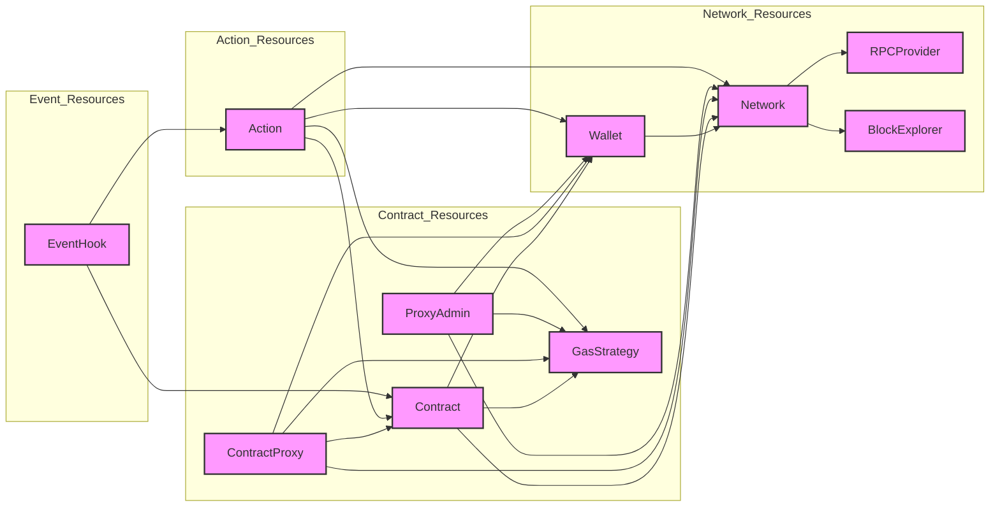

# KontractDeployer

Kubernetes operator for smart contracts deployment

## Overview

Simplifies the deployment of blockchain resources with strait forward deployment principals. It utilizes the integrations of Kubernetes with third-party tools and the powerful API to provide the best production ready deployment method.

## Deployment Method

### Bring Your Own Cluster (BYOC)

- The user provides their own Kubernetes cluster.
- The user installs the operator onto their cluster using a Helm chart.

### Managed Kubernetes (SaaS)

- The user gets access to already exists Kubernetes cluster with the operator installed.
- The user get access to the service via API

## Kubernetes Resources



### RPCProvider

**Description**: The RPCProvider resource represents a managed Remote Procedure Call (RPC) provider, which facilitates interaction with the blockchain network.

**Role**: Provides RPC services to other blockchain-related resources. Supports integration with third-party services (e.g., Infura, Alchemy). Securely manages API tokens using Kubernetes Secrets.

**Interaction**: Network resources reference RPCProvider to interact with blockchain networks. The operator uses the secretRef to retrieve the API token and append it to the RPC requests.

```yaml
apiVersion: expedio.xyz/v1alpha1
kind: RPCProvider
metadata:
  name: my-rpc-provider
spec:
  providerName: Infura
  endpoint: <https://mainnet.infura.io/v3/YOUR_INFURA_PROJECT_ID>
  secretRef:
    name: infura-api-secret
    key: api-token
  timeout: 5s
```

### _BlockExplorer_

**Description**: The BlockExplorer resource represents a managed block explorer service that provides detailed blockchain data, including transaction details, block information, and contract interactions. This resource is linked to specific blockchain networks via the Network resource, providing a consistent and secure method for querying blockchain data.

**Role**: Supports integration with third-party block explorer services (e.g., Etherscan, BlockCypher, Blockchain.info). Manages API tokens securely using Kubernetes Secrets. Provides blockchain data to other resources indirectly through the Network resource.

**Interactions**: The BlockExplorer resource acts as a centralized service for retrieving blockchain data. It is directly referenced by the Network resource, which in turn is referenced by other resources like Contract, Action, and EventHook.

```yaml
apiVersion: expedio.xyz/v1alpha1
kind: BlockExplorer
metadata:
  name: etherscan-explorer
spec:
  explorerName: Etherscan
  endpoint: <https://api.etherscan.io/api>
  secretRef:
    name: etherscan-api-secret
    key: api-token
```

### Network

**Description**: The Network resource represents a specific blockchain network (e.g., Ethereum Mainnet, Ropsten) that is used for deploying and interacting with smart contracts.

**Role**: Represents the blockchain network configuration.

Ensures secure communication and interaction with the blockchain.

**Interaction**: Referenced by Contract and Wallet resources to determine the network on which they operate.

```yaml
apiVersion: expedio.xyz/v1alpha1
kind: Network
metadata:
  name: ethereum-mainnet
spec:
  networkName: EthereumMainnet
  chainID: 1
  rpcProviderRef: my-rpc-provider
  blockExplorerRef: etherscan-explorer
  gasPriceOracle: <https://gas.oracle.example.com>
```

### Wallet

**Description**: The Wallet resource represents a blockchain wallet, either managed internally or integrated with external wallet services. The resource also supports importing existing wallet from a secret.

**Role**: Manages the cryptographic keys required for signing transactions.

Can support multiple wallet types, including externally managed wallets.

**Interaction**: Referenced by Contract for deploying and interacting with contracts on the blockchain.

```yaml
apiVersion: blockchain.io/v1alpha1
kind: Wallet
metadata:
  name: my-wallet
spec:
  walletType: EOA
  secretRef: my-wallet-secret
  networkRef: ethereum-mainnet
  import: true
status:
  publicKey: 0x...
```

### Contract

**Description**: The Contract resource represents a smart contract that is intended to be deployed on the blockchain. The resource also supports importing existing contracts that were deployed outside the operator's management.

**Role**: Encapsulates the smart contract code, tests and deployment configurations. If the tests passed, the contract is deployed. Once deployed, the contract is immutable. Upgrades are handled via a proxy contract pointing to new implementations.

**Interaction**: Depends on Network and Wallet resources to determine where and how the contract is deployed. The ContractProxy resource references the Contract resource when a new implementation is deployed.

```yaml
apiVersion: expedio.xyz/v1alpha1
kind: Contract
metadata:
  name: my-smart-contract
spec:
  import: false
  contractName: MySmartContract
  networkRef: ethereum-mainnet
  walletRef: my-wallet
  gasStrategyRef: high-priority-gas
  contractAddress: 0x...
  code: |
    // SPDX-License-Identifier: MIT
    pragma solidity ^0.8.0;
    contract MySmartContract {
      uint256 public value;
      function setValue(uint256 newValue) public {
        value = newValue;
      }
    }
  test: |
    // SPDX-License-Identifier: MIT
    pragma solidity ^0.8.0;
    import "ds-test/test.sol";
    import "../MySmartContract.sol";
    contract MySmartContractTest is DSTest {
      MySmartContract myContract;
      function setUp() public {
        myContract = new MySmartContract();
      }
      function testInitialValue() public {
        assertEq(myContract.value(), 0);
      }
    }
status:
  contractAddress: 0x...
  deploymentTime: 2024-09-01T00:00:00Z
  transactionHash: 0x...
  test: passed
  state: deployed
```

### ContractProxy

**Description**: The ContractProxy resource represents a proxy contract that delegates function calls to an underlying implementation (logic) contract. The proxy remains constant while the implementation can be upgraded over time by deploying a new Contract resource and updating the proxy reference. This resource manages the deployment and configuration of the proxy contract.

**Role**: The ContractProxy resource encapsulates the proxy logic, which forwards calls to the current implementation contract. It enables contract upgrades by updating the reference to the implementation contract, without changing the proxy address.

**Interaction**: The ContractProxy resource interacts with the ProxyAdmin to facilitate upgrades by changing the implementation contract reference.

```yaml
apiVersion: expedio.xyz/v1alpha1
kind: ContractProxy
metadata:
  name: my-upgradeable-proxy
spec:
  proxyType: Transparent
  networkRef: ethereum-mainnet
  walletRef: my-wallet
  gasStrategyRef: high-priority-gas
  implementationRef: my-implementation-contract-v1
  proxyAdminRef: my-proxy-admin
status:
  proxyAddress: 0x...
```

### ProxyAdmin

**Description**: The ProxyAdmin resource represents a contract that manages upgrades for proxy contracts. It controls the proxy and has the authority to change its implementation contract to point to a new version. This resource ensures that upgrades are performed securely and can be rolled back if necessary.

**Role**: The ProxyAdmin resource serves as the administrator for one or more proxy contracts, enabling secure and controlled upgrades of the underlying implementation contracts. It abstracts the complexity of managing multiple proxy contracts and centralizes the upgrade logic.

**Interaction**: The ProxyAdmin resource interacts with ContractProxy resources to change their implementation reference during an upgrade. Action resources can execute upgrades by invoking functions on the ProxyAdmin contract.

```yaml
apiVersion: expedio.xyz/v1alpha1
kind: ProxyAdmin
metadata:
  name: my-proxy-admin
spec:
  networkRef: ethereum-mainnet
  walletRef: my-wallet
  gasStrategyRef: high-priority-gas
  adminAddress: 0x...
```

### Action

**Description**: The Action resource represents a specific operation that a user can perform on a deployed smart contract or blockchain resource. This can include invoking a function, querying state, testing, upgrading an implementation, or any other interaction with the blockchain. It supports both one-time and scheduled operations, allowing for versatile and automated workflows.

**Role**: The Action resource provides a standardized way to define and execute blockchain operations including: invoke, query, upgrade andtest.

**Interaction**: The Action resource is used to trigger operations on smart contracts or other blockchain resources. It interacts with the relevant resources and logs the outcome of each action. It can be scheduled for recurring actions or triggered manually.

```yaml
apiVersion: expedio.xyz/v1alpha1
kind: Action
metadata:
  name: perform-blockchain-action
spec:
  actionType: invoke # Type of action (invoke, query, upgrade, test)

  # General fields applicable to all actions
  contractRef: my-smart-contract # Reference to the Contract resource (for 'invoke', 'query', and 'test')
  walletRef: my-wallet # Reference to the Wallet resource
  networkRef: ethereum-mainnet # Reference to the Network resource
  gasStrategyRef: high-priority-gas # Reference to the GasStrategy resource

  # Fields for 'invoke' and 'test' actions
  functionName: setParameter # Name of the contract function to execute (if actionType is 'invoke' or 'test')
  parameters: # Parameters to pass to the function
    - name: param1
      value: "123"
    - name: param2
      value: "abc"

  # Optional scheduling
  schedule: "0 0 * * *" # Optional, cron schedule for recurring actions

status:
  lastExecution: 2024-09-01T00:00:00Z # Timestamp of the last execution
  transactionHash: 0x... # Transaction hash of the last action execution (if applicable)
  result: Success # Result of the last action execution (Success, Failure)
```

### EventHook

**Description**: The EventHook resource is used to trigger specific actions or operations based on blockchain events.

**Role**: Automatically triggers predefined actions when specific blockchain events occur. Supports filtering of events to fine-tune when actions should be triggered.

**Interaction**: Watches for events on the blockchain and triggers corresponding Action resources when the conditions are met.

```yaml
apiVersion: expedio.xyz/v1alpha1
kind: EventHook
metadata:
  name: upgrade-trigger
spec:
  eventType: BlockMined # Event that triggers the hook (BlockMined, ContractEvent)
  contractRef: my-smart-contract # Reference to the Contract resource
  actionRef: test-contract-function # Reference to the Action resource to be triggered
  filter: # Optional, filter conditions for the event
    blockNumber: "123456"
    eventName: "Upgrade"
```

### GasStrategy

**Description**: The GasStrategy resource defines the gas price strategy for blockchain transactions. It allows users to specify how gas prices should be calculated for individual contracts or actions, enabling customized optimization based on the specific needs of each function or transaction.

**Role**: The GasStrategy resource provides fine-grained control over gas price management, allowing different contracts or actions to use distinct strategies based on their requirements. It supports fixed pricing, oracle-based dynamic pricing, and other custom strategies, ensuring that each transaction can be optimized for cost or speed as needed.

**Integrations**: Integrates with gas price oracles to dynamically adjust gas prices according to current network conditions. Can be used with fixed gas prices for predictable and controlled costs. Supports upper and lower bounds to avoid excessive fees or transaction failures.

```yaml
apiVersion: expedio.xyz/v1alpha1
kind: GasStrategy
metadata:
  name: high-priority-gas
spec:
  strategyType: dynamic # Types: fixed, oracle, dynamic
  gasPriceOracle: https://gas.oracle.example.com # URL to a gas price oracle
  fallbackGasPrice: "100 Gwei" # Fallback gas price if the oracle is unavailable
  maxGasPrice: "300 Gwei" # Maximum allowed gas price
  minGasPrice: "50 Gwei" # Minimum allowed gas price
  secretRef: # (Optional) Reference to the Kubernetes Secret containing the API token for the oracle
    name: gas-oracle-secret
    key: api-token # Key in the Secret that stores the API token
```

## User Workflows

### Initial Setup

Set up the foundational components for blockchain resource management.

Steps:

- Create RPCProvider: Set up communication with the blockchain network.
- Create BlockExplorer: Enable blockchain data retrieval.
- Create Network: Define the blockchain network (e.g., Ethereum Mainnet).
- Create Wallet: Manage cryptographic keys for transactions.

### Contract Deployment

Deploy a smart contract to the blockchain.

Steps:

- Store Contract Code: Use a ConfigMap to store the smart contract code.
- Deploy Contract: Reference the ConfigMap, specify Network, Wallet, and GasStrategy.
- Track Deployment: The contract's status will automatically capture deployment details such as contract address, deployment time, and transaction hash.

### Contract Upgrade

Upgrade a deployed smart contract with a new implementation.

Steps:

- Update Contract Code: Store the updated code in a new ConfigMap.
- Deploy New Contract: Create a new Contract resource for the updated code.
- Upgrade Proxy: Use an Action resource to update the proxy contract to the new implementation.
- Log Upgrade: The proxy's status will reflect the updated implementation contract.

### Upgrade Order

Manage the deployment order of interdependent contracts.

Steps:

- Deploy First Contract: Deploy the first contract using the Contract resource.
- Test Deployment: Use an Action resource to verify the deployment before proceeding.
- Deploy Second Contract: Deploy the second contract, referencing the first contract's address if needed.
- Log Deployments: Ensure all relevant proxy updates and contract addresses are correctly captured.

### Fully CI/CD With Gitlab CI

Implement CI/CD for smart contracts using GitLab CI.

Steps:

- Set Up Pipeline: Define stages for build, test, and deploy in .gitlab-ci.yml.
- Automate Initial Setup: Use the pipeline to create necessary Kubernetes resources.
- Automate Contract Deployment: Deploy contracts automatically through the pipeline.
- Automate Upgrades: Manage contract upgrades using Action resources and proxy updates.
- Automate Testing: Run tests and validate contract states as part of the CI/CD process.

### Import Wallet and Contract

This workflow allows you to import both an existing wallet and a smart contract into the system for seamless management and interaction.

Steps:

- Create Wallet Resource:
  - Define a Wallet resource in your Kubernetes cluster.
  - Set the import flag to true.
  - Reference the Kubernetes Secret containing the wallet’s private key or mnemonic.
  - The system automatically extracts and stores the public key in the status field.
- Create Contract Resource:
  - After the wallet is imported, define a Contract resource in your Kubernetes cluster.
  - Set the import flag to true.
  - Provide the contract address and name.
  - The system will use the provided contract address to sync the current state and populate the status fields.

## Controller

### Overview

The controller is the central component of the Kubernetes operator, automating the management of blockchain-related resources. It handles tasks like contract deployment, upgrades, and blockchain interactions by reacting to changes in custom resources and orchestrating Kubernetes Jobs.

### Key Responsibilities

1. **Reconciliation**: Ensures that the actual state of resources matches the desired state defined in the custom resources.
2. **Job Management**: Creates and manages Kubernetes Jobs to perform specific tasks, such as deploying contracts or executing actions.
3. **Error Handling**: Implements retries, manages failures, and handles rollbacks if necessary.
4. **Status Updates**: Regularly updates resource status fields to reflect the current state and outcomes of operations.

### Components

1. **Reconciliation**
   - Function: Monitors changes in custom resources using Kubernetes Informers.
   - Purpose: Ensures the desired state matches the real state.
2. **Job Creation and Management**
   - Function: Creates Kubernetes Jobs to handle tasks like deploying contracts, executing blockchain actions, or performing upgrades.
   - Purpose: Encapsulates tasks in isolated, repeatable Jobs for reliability and modularity.
3. **Error Handling**
   - Function: Detects and responds to job failures, including implementing retries and logging errors.
   - Purpose: Ensures robustness and system stability by managing errors effectively.
4. **Status Management**
   - Function: Updates the status of resources (e.g., contract deployment success, action execution results).
   - Purpose: Provides real-time feedback on the status and outcome of operations.

### Workflows

1. **Contract Deployment:**
   - Detect: A new Contract resource is created.
   - Reconcile: The controller identifies the need to deploy the contract.
   - Create Job: A Job is created to deploy the contract using Foundry's forge tool.
     - Parameters: The Job is configured with the function name, parameters, and references to the Contract, Wallet, and Network resources.
   - Execute: The Job compiles, tests, and deploys the contract to the specified blockchain network.
   - Update Status: The controller updates the Contract resource with deployment details, including the contract address and transaction hash.
2. **Action Execution:**
   - Detect: An Action resource is created, specifying a function to invoke on a deployed smart contract.
   - Reconcile: The controller determines the need to execute the specified action.
   - Create Job: A Job is created to perform the action using Foundry's cast tool.
     - Parameters: The Job is configured with the function name, parameters, and references to the Contract, Wallet, and Network resources.
   - Execute: The Job runs, executing the function on the blockchain as specified in the Action resource.
   - Update Status: The controller updates the Action resource with the result of the execution, including the transaction hash and success or failure status.
